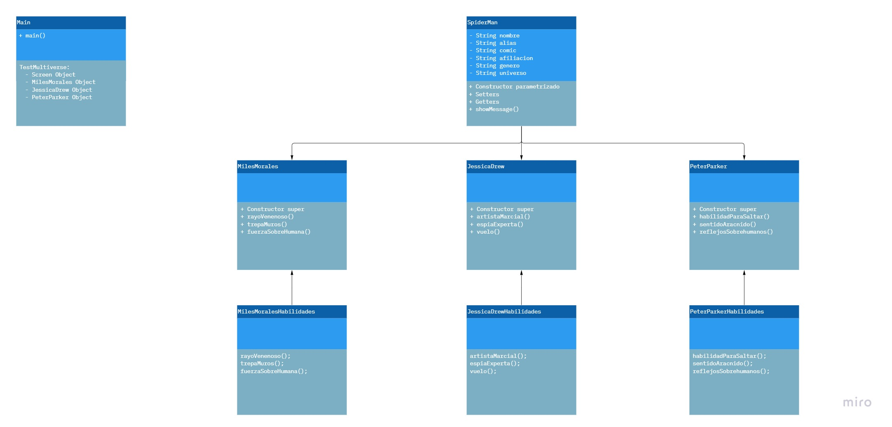

# BackEndJava

### [Práctica Harry](./src/practicaHarry/) - Modelado

### [Práctica Mona](./src/practicaMona/) - Herencia y polimorfismo

### [Práctica Multiverse](./src/practicaMultiverse/) - Interfaces

## Sitios web 🔍

[Harry Potter](https://harrypotter.fandom.com/wiki/Harry_Potter)

[GitHub Octodex](https://octodex.github.com/)

[Spider-Man](https://spider-man.fandom.com/es/wiki/Spider-Man_Wiki)